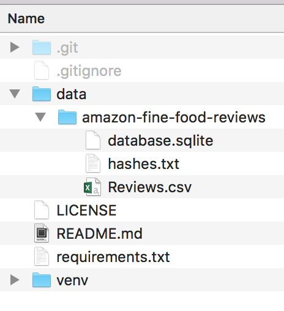

# amazon-food-reviews
Testing out spaCy on the [Amazon Fine Food Reviews dataset from Kaggle](https://www.kaggle.com/snap/amazon-fine-food-reviews)

# Data

Download the data to a directory called `data/` in this repo.

# Tutorials used

* [Plotly tutorial](https://plot.ly/python/ipython-notebook-tutorial/)
* [spaCy usage samples](https://spacy.io/usage/examples)
* [Using Jupyter with a virtualenv](https://janikarhunen.fi/how-to-install-jupyter-to-virtualenv.html)
